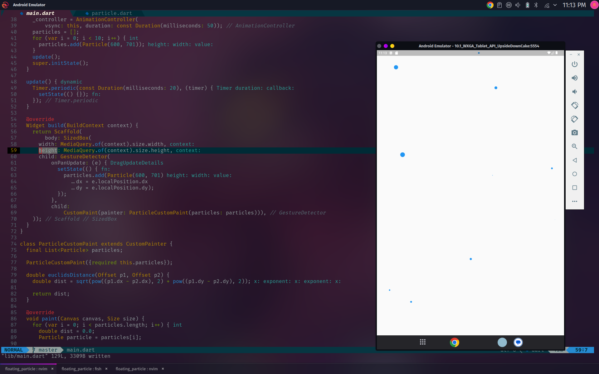
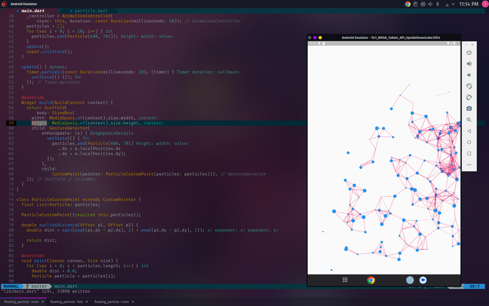

# Floating Particles

> [Ranaco](https://github.com/Ranaco)

<br/>




### Logic

The only maths topic you need to know this for is Eucledian Distance Formula that is ::

```arduino
var distance = sqrt(pow(x1 - x2, 2) + pow(y2 - y1, 2))

```

There is a particle class that holds the parameteers like position, speed and radius of
the particles.

A timer function runs every 20 milliseconds to update UI
and for the rest delve yourself in the code.
